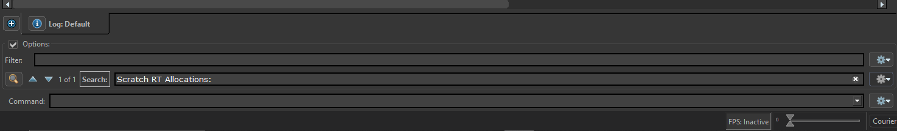
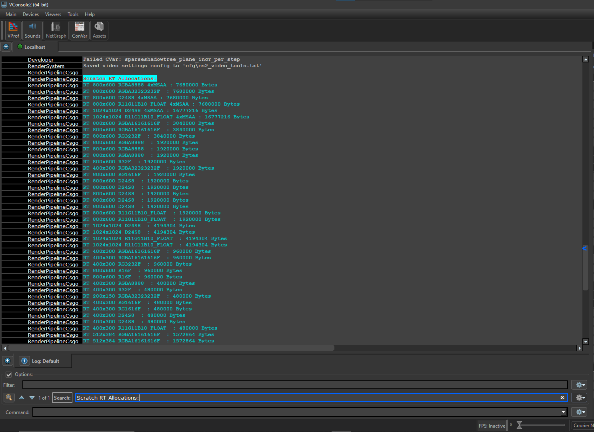
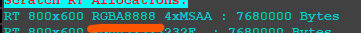
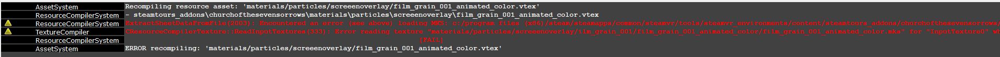
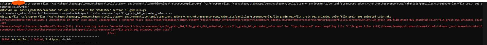
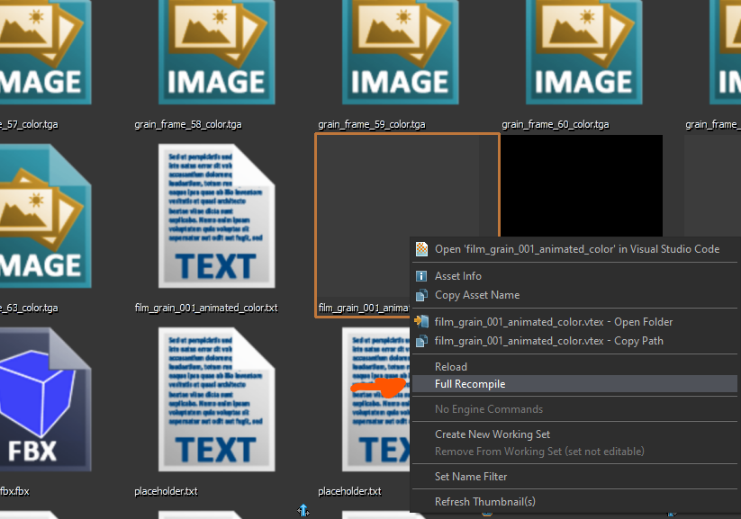
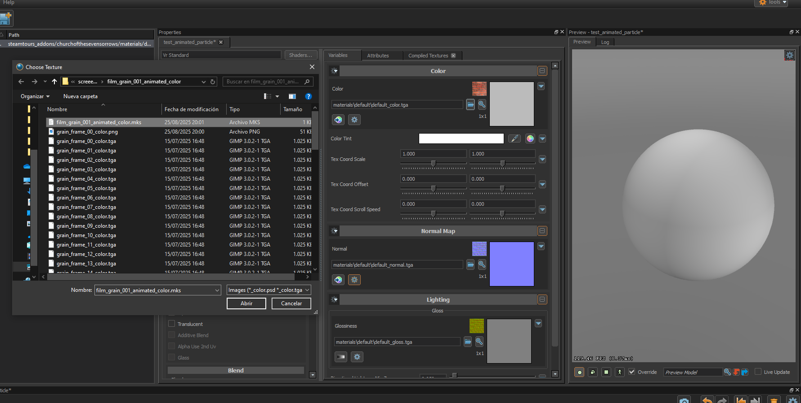
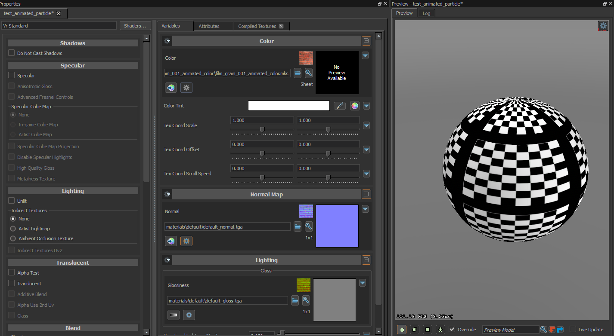

There are several methods to create animated textures in Source 2. We will follow the standard workflow, using the official tools for the creation of animated textures.  

Firstly, there are two types of animated textures:  
1. The animated texture that loops non-stop.  
2. The animated texture that only executes a sequence (commonly used in particles).  

We create a `.mks` file. This file must follow the format below:

:::info
C-style comments are supported. Block comments are not!  
`// This is a comment` ✅ Correct  
`/* This is a comment */` ❌ Fails to compile
:::
:::info
The `frame` KeyValue is a path to an image file, after always termine the line with and extra `1`, for example:

`frame grain_frame_00_color.tga 1`
:::
:::info
The images you use (so the compiler can generate an atlas) are highly recommended to be in a resolution that is a power of two (2^n) or divisible by two.  
This way the generated atlas is more likely to be filled efficiently (less wasted space).  
The number of frames should also be a power of two or divisible by two.
:::
:::info
The compiler by default will generate the best resolution for the altas, many times you will enconter an error saying that the compiler could not find what resolution suits the best for the altas,
in that case try:

1. Use power of two textures or divisible by two.
2. Use a lower resolution (Instead of 1024x1024 use 512x512).
3. Lower the number of frames used in the animated texture (So the compiler can generate fit all the images inside the altas). 
:::
```
sequence 0
loop   // Remove this if your animated texture doesn’t need to loop. 

frame "frame1" 1
frame "frame2" 1
frame "frame3" 1
    .
    .
    .
frame "frameN" 1
```

The `.mks` format also supports multiple sequences. For example:

```
sequence 0
frame "s1frame1" 1
frame "s1frame2" 1
frame "s1frame3" 1
    .
    .
    .
frame "s1frameN" 1

sequence 1
frame "s2frame1" 1
frame "s2frame2" 1
frame "s2frame3" 1
    .
    .
    .
frame "s2frameN" 1

.
.
.

sequence N
frame "sNframe1" 1
frame "sNframe2" 1
frame "sNframe3" 1
    .
    .
    .
frame "sNframeN" 1
```

Once you have created your `.mks` file, it will tell the compiler how to create the [atlas](https://en.wikipedia.org/wiki/Texture_atlas) for your animated texture.  

After defining the animated texture, we need to compile it so it can be used in particles or materials. There are different workflows depending on the case.  

Let’s start with **particles**:  
Particles usually don’t use materials. They use textures. For that, we need to create a texture by making a `.vtex` file.  
In the `"m_fileName" "string"` KeyValue2, you must type the relative path of your `.mks` file.  

Example:  
`"m_fileName" "string" "materials/particles/screenoverlay/film_grain_001/film_grain_001_animated.mks"`

Here is a complete example of how your `.vtex` file should look:

:::tip
You can change the compression format of the compiled texture! (Very useful when dealing with pure/strong colors)

Go to the `"m_outputFormat" "string" "CompressionFormat"` KeyValue2 and type your desired compression format.  
Example: `"m_outputFormat" "string" "RGBA8888"`  

To know what compression formats Source 2 supports, start the game, open `vconsole2.exe`, and search for `Scratch RT Allocations:`  

  
  

The compression format is shown with an orange underline.  


:::

```
<!-- dmx encoding keyvalues2_noids 4 format vtex 1 -->
"CDmeVtex"
{
	"m_inputTextureArray" "element_array" 
	[
		"CDmeInputTexture"
		{
			"m_name" "string" "InputTexture0"
			"m_fileName" "string" "materials/particles/screenoverlay/film_grain_001/film_grain_001_animated.mks" // Replace this string with your relative path to the .mks file.
			"m_colorSpace" "string" "srgb"
			"m_typeString" "string" "2D"
			"m_imageProcessorArray" "element_array" 
			[
				"CDmeImageProcessor"
				{
					"m_algorithm" "string" "None"
					"m_stringArg" "string" ""
					"m_vFloat4Arg" "vector4" "0 0 0 0"
				}
			]
		}
	]
	"m_outputTypeString" "string" "2D"
	"m_outputFormat" "string" "RGBA8888"
	"m_outputClearColor" "vector4" "0 0 0 0"
	"m_nOutputMinDimension" "int" "0"
	"m_nOutputMaxDimension" "int" "0"
	"m_textureOutputChannelArray" "element_array" 
    [
		"CDmeTextureOutputChannel"
		{
			"m_inputTextureArray" "string_array" [ "InputTexture0" ]
			"m_srcChannels" "string" "rgba"
			"m_dstChannels" "string" "rgba"
			"m_mipAlgorithm" "CDmeImageProcessor"
			{
				"m_algorithm" "string" "Box"
				"m_stringArg" "string" ""
				"m_vFloat4Arg" "vector4" "0 0 0 0"
			}
			"m_outputColorSpace" "string" "srgb"
		}
	]
	
    "m_vClamp" "vector3" "0 0 0"
    "m_bNoLod" "bool" "0"
}
```

---
Once the `.vtex` file is configured, you need to compile it. Usually this happens when you first load the tools if everything is set up correctly. If it doesn’t appear, open the asset browser, right-click, and select `Full Recompile`.

:::tip
Many times when compiling the `.vtex` or `.vmat` file you may make mistakes in the `.mks`.  
The error shown in `vconsole2.exe` is often unclear. Run `resourcecompiler.exe` to get the full error output.

`vconsole2.exe` error:



`resourcecompiler.exe` (full) error: 


:::



Now your texture is ready to use for particles!

---

For *materials* the process is very similar, in the *Material editor*, create a new material, open the dialog to import a texture and select the `.mks` file.




---
