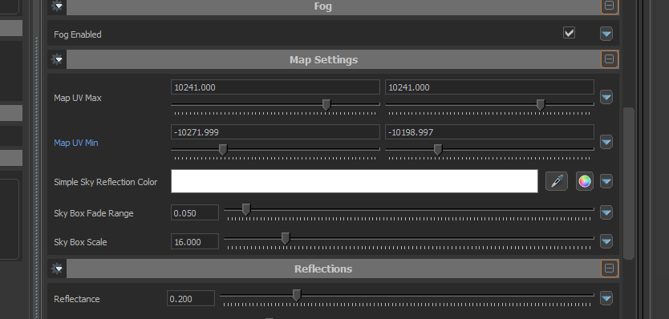

This guide explains how to seamlessly blend the main level water with water in the 3D skybox.

:::warning
For some reason valve chose to put this setting on the actual water material!\
As such, if you are not using a custom water material, use <Tool name="s2v" link="https://valveresourceformat.github.io/" /> to decompile the material into your addon first, so that it can be edited. 
:::

Open your water material in the Material Editor, and go the "Map Settings" section. Here you can change the "Map UV Min/Max" settings to tweak where the fade happens.

