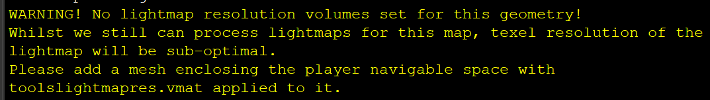
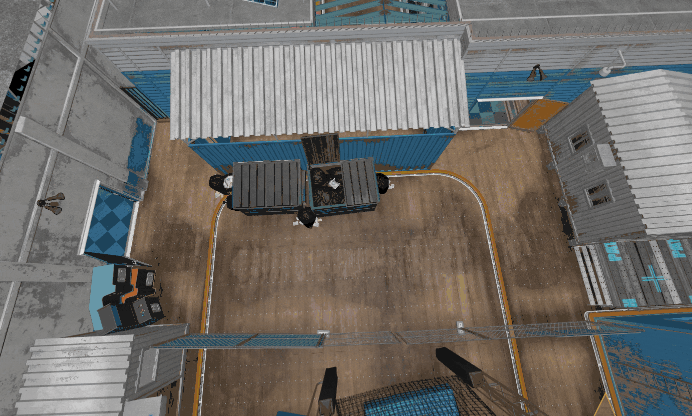
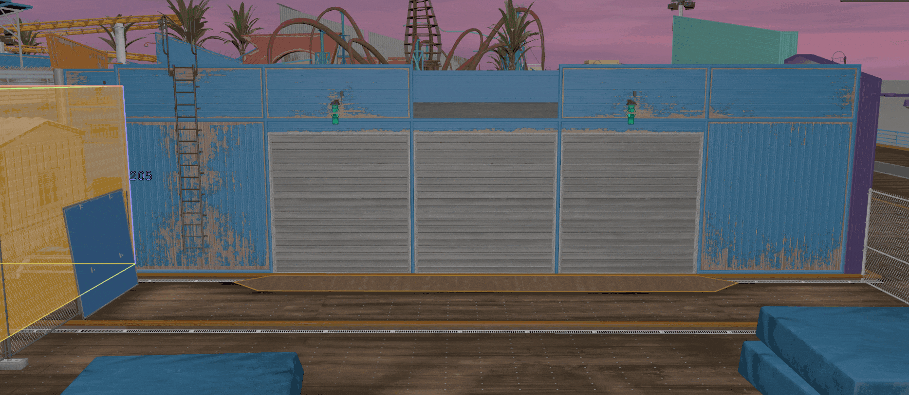

This guide explains how lightmap player space volumes help improve the lighting quality in your map, and how to place them.

:::info
The lightmap is a single big texture which contains pre-calculated lighting for all the static surfaces in the level.
:::

Placing lightmap player space volumes is a very important lighting optimisation step in Source2 branches which mainly rely on lightmapping for level lighting, such as <Game name="cs2"/> and <Game name="hla"/>

Correct placement of these volumes will cause the lightmapper to automatically assign the highest light resolution to surfaces that the player will actually see up close, and less resolution to distant scenery outside of the map,
 your map will still compile without these, but lighting will be sub-optimal as indicated by this compile warning:

## Creating lightmap player space volumes

To create these simply use the Block tool to make the meshes, make sure to apply the `materials/tools/toolslightmapres.vmat` material! this is what actually makes the engine count them as lightmap player space volumes!

They should fill every space in your level where the player is expected to be, placement example:

Starting from the surface of the volume lightmap resolution will slowly decrease, as such you should try to be somewhat accurate with your placement, as a rule of thumb surfaces that the player can view up close should never be further than 16 units away from the surface of a volume!

## Viewing luxel density

:::info
You can view the lightmap resolution by clicking the `Show Lightmap Res/Luxels` button in the convar helper section of the console, or by using the `mat_luxels 1` command 
:::

Below is an example of how the lightmap player space volume will affect the luxel density in the compiled level, notice how the resolution gets lower further away from the volume, from left to right.

This might seem subtle, but in a full level it adds up! unless your level is very simple or small, you should never ship a production level without lightmap player space volumes!