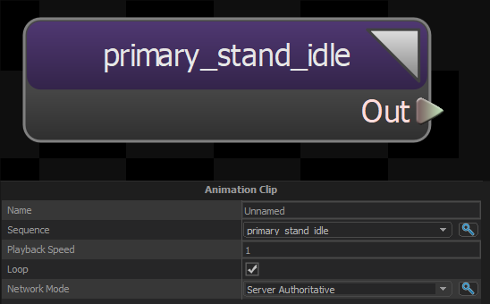
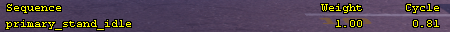
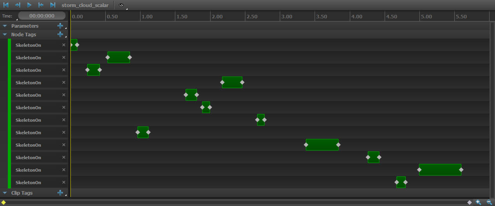

Animation Clip Node represents a single keyframed animation sequence and it's responsible for it's basic playback as the part of the graph. 

:::info
The sequence will play based on cycle's playback time (0.00).

:::
 Resetting a Keyframed Anim Node will set its playback time (and current frame) back to zero.

 ## Tag playback
  While an animation clip is playing, tags and parameters can be set during it's duration. They can be set per-node, which means they will only be emitted per this node, or per-clip, which means every instance of the animation will emit them.
 

