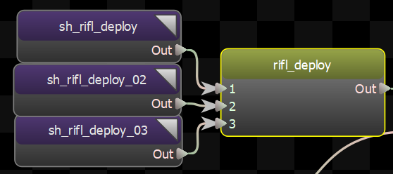
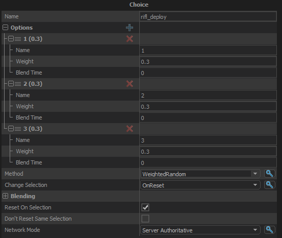

Choice node will choose one of it's children to be played randomly based on methods.

The options can blend from old choice to a new one when a new choice has been made and a node has not been reset. 

There is an option to control the duration for that named Blend Duration, and there is an option to reset children when they get selected, along with a crossfade option.

## Weights
Weights are based on probability if it will be selected, they are NOT percentage based, they are relative to the sum of all the weights for all the options.

## Methods
There are 4 methods to pick a child node.

- <b>WeightedRandom:</b> Randomly choose the next child based on their weighting.  Can pick the same child twice in a row.  
- <b>WeightedRandomNoRepeat:</b> Same as WeightedRandom, but prevents the same child from being chosen twice in a row.  
- <b>Iterate:</b> The next selected child is the one that comes after the current one.  
- <b>IterateRandom:</b> Randomly choose between the children that have not been played, and don't repeat any children until they've all been played.   

## Change Selection
And 3 methods to determine when the node selects a new child.

- <b>OnReset:</b> Only make a new choice when the node is reset by its parent.  
- <b>OnCycleEnd:</b> Make a new selection when the current one has finished playing.   
- <b>OnResetOrCycleEnd:</b> Make a new choice when the node is reset or when the current selecion's cycle ends.  

## Blend Methods

Methods for how the blend time is chosen when blending between choices.

- <b>Single Blend Time:</b> a single value specified in the node settings is used for all blends, not match which choice item is picked. 
- <b>Per-Choice Blend Times:</b> The blend time of the new selection is used. 