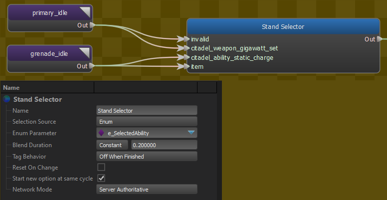
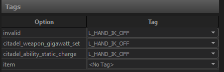

Selects between two or more child nodes based on either a bool/enum parameter or a tag.  

It also provides support for blending between children when the \"current\" one changes, and for activating tags based on the \"current\" child.

## Tag Behavior
Sets the logic use to determine when the tag associated with an option is active.

- <b>Active While Current:</b> The current selection's tag is active the entire time it is the current selection. 
- <b>Off When Finished:</b> The current selection's tag is active until the node associated with it indicates that it is \"finished\"  
- <b>Off Before Finished:</b> The current selection's tag is active up until <em>Blend Duration</em> seconds before the node associated with it is expected to be finished.  

