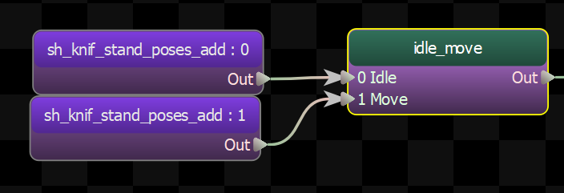
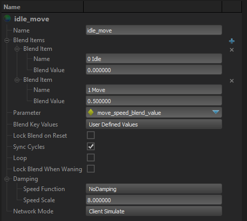

This node blends between a set of child nodes in one dimension.

The node is given an input parameter to track, and each node is given a value.  

The node will then find the two children whose values the input parameter is between, and blend between them.

 ## Blend Keyvalues

 Each child of this node has a "blend key" value associated with it that is used to create the blend.  This setting determines where those values come from.  The user can manually specify the blend values in the Blend Items setting, or they can be derived from the properties of the children themselves.

- <b> User Defined Values:</b> The user-defined values entered in the Blend Value field of each entry in the Blend Items list are used as the key values for each child.  
- <b> Velocity:</b> The speed of each child node is used as its key value.  NOTE: When this option is used, it is assumed that Blend Source is also a speed, and the blended animation will be played back at a speed that matches the value of the Blend Source, even if it is outside the range of the child animations.  
- <b> Distance:</b> The total distance that each child node moves over the course of the entire animation is used as the blend key value for each child node.  

Note that the user-entered blend values are only used when the Blend Key Values setting is User Defined Values.

 ## Lock Blend on Reset

 When false, the blend is refreshed every frame.

 When true, the blend is only refresh when the node is reset.  The cycle advances normally, however.  This is so that you can keep the blend value the same for the duration of the playback of an animation, even if the input value changes.

 ## Sync Cycles

 Set this option to true to make all the blended animations have the same cycle.  The blend node will adjust the playback speed of its children so that they after each tick their cycles match.

 ## Loop

 Toggle whether or not the playback of the child nodes should loop.

Note that the Blend 1D node explicitly controls the playback of its children, so that it can ensure that their cycles always match, even if the animations are different lengths.  This means that the loop setting on the children of blend nodes is ignored, and only the loop setting on the Blend 1D node matters.

## Lock Blend When Waning

When true, the blend value will not get update while this node is being blended out of (aka: \"Waning\")

## Damping

Controls how the output of this node is blended over time.

### Speed Function
Controls how damped speed is adjusted based on how far the current value is from the target value. 
- <b>No Damping:</b> Damping is not applied.  
- <b>Constant:</b> The damping speed does not change with distance from the target value.  
- <b>Spring:</b> A critically damped spring is used to accelerate the current value toward the target value.  The farther the current value is from the target, the more the acceleration.  However the spring will not overshoot the target value.  
- <b>Asymmetric Spring</b>
### Speed Scale
Scales the speed of the damping, or in the case of the Spring <b>Speed Function</b> it controls the strength of the spring.
### Speed Scale (Falling)
When using AsymmetricSpring for <b>Speed Function</b> it controls the strength of the spring, only when damping to a lower value.
### Limit Speed
Toggle whether or not to clamp the damping speed
### Min Speed
If <b>Limit Speed </b>is set, this is the slowest speed that the dampened value can change at.
### Max Speed
If <b>Limit Speed </b>is set, this is the fastest speed that the dampened value can change at.

