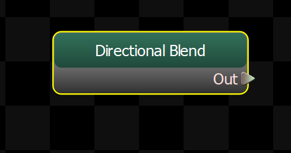
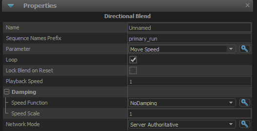

Like a Blend 1D, but specially configured for blends based on direction.

## Sequence Name Prefix
To avoid having to hook up 8 animations each time you use one of these nodes, you just need to give it the first part of the name of your animations, and it will append the suffixes to those names and load them. It looks for:

*_n
*_nw
*_w
*_sw
*_s
*_se
*_e
*_ne

## Parameter
If <b>Blend Source</b> is set to \"Parameter\", then this field indicates which parameter to use.  Only supports Float Parameters.

## Loop
When true, the cycle of the blended animations will loop.
## Lock Blend on Reset
Setting this to true will cause the blend weights to only get recalculated when this node is reset.
## Playback Speed
The speed at which the animations should be played back.  ie: 1 is normal speed, 2 is twice normal speed.

## Damping

Controls how the output of this node is blended over time.

### Speed Function
Controls how damped speed is adjusted based on how far the current value is from the target value. 
- <b>No Damping:</b> Damping is not applied.  
- <b>Constant:</b> The damping speed does not change with distance from the target value.  
- <b>Spring:</b> A critically damped spring is used to accelerate the current value toward the target value.  The farther the current value is from the target, the more the acceleration.  However the spring will not overshoot the target value.  
- <b>Asymmetric Spring</b>
### Speed Scale
Scales the speed of the damping, or in the case of the Spring <b>Speed Function</b> it controls the strength of the spring.
### Speed Scale (Falling)
When using AsymmetricSpring for <b>Speed Function</b> it controls the strength of the spring, only when damping to a lower value.
### Limit Speed
Toggle whether or not to clamp the damping speed
### Min Speed
If <b>Limit Speed </b>is set, this is the slowest speed that the dampened value can change at.
### Max Speed
If <b>Limit Speed </b>is set, this is the fastest speed that the dampened value can change at.
