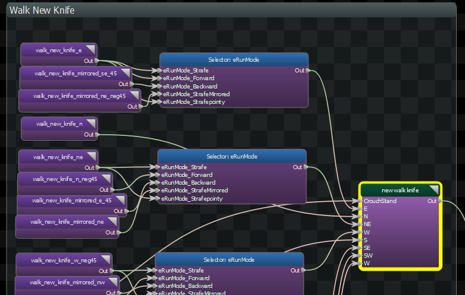
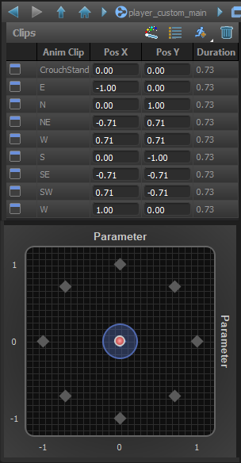

Blends between a set of animations based on the values of two variables. It can be either two parameters representing Horizontal/Vertical directions, or Blend Axes directly.

2D Blend node can use a list of animations, or can connect to nodes to blend between and the defined 2D coordinates in the blend space.

## Blend Mode
Choose between methods used to calculate the blend weights for the animations based on the current 2D blend value.  

- <b> General </b>: A context-independent 2D blending technique.  Good for many situations.  
- <b> Directional </b>: If the blend values are directions, using this method can produce more accurate results.  

## Loop
Toggle whether or not the animations should loop or stop at the end.

## Lock Blend on Reset
When false, the blend is refreshed every frame.

When true, the blend is only refresh when the node is reset.  The cycle advances normally, however.  This is so that you can keep the blend value the same for the duration of the playback of an animation, even if the input value changes.

## Playback Speed
Adjusts the speed at which the animations play. 

## AnimEvents and Tags Exclusive To Most Weighted
When selected, AnimEvents and Tags will only be emitted from the one anim clip who is weighted the most.

## Damping

Controls how the output of this node is blended over time.

### Speed Function
Controls how damped speed is adjusted based on how far the current value is from the target value. 
- <b>No Damping:</b> Damping is not applied.  
- <b>Constant:</b> The damping speed does not change with distance from the target value.  
- <b>Spring:</b> A critically damped spring is used to accelerate the current value toward the target value.  The farther the current value is from the target, the more the acceleration.  However the spring will not overshoot the target value.  
- <b>Asymmetric Spring</b>
### Speed Scale
Scales the speed of the damping, or in the case of the Spring <b>Speed Function</b> it controls the strength of the spring.
### Speed Scale (Falling)
When using AsymmetricSpring for <b>Speed Function</b> it controls the strength of the spring, only when damping to a lower value.
### Limit Speed
Toggle whether or not to clamp the damping speed
### Min Speed
If <b>Limit Speed </b>is set, this is the slowest speed that the dampened value can change at.
### Max Speed
If <b>Limit Speed </b>is set, this is the fastest speed that the dampened value can change at.