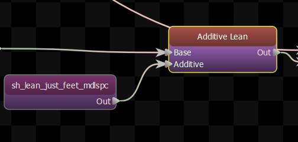
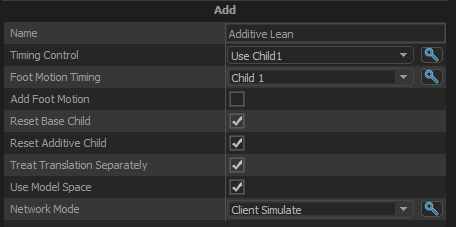

This node is used to additively blend two child nodes together.

In order for this node to work properly, your animation must be made into an additive. This is accomplished with ModelDoc nodes such as AnimSubtract/AnimSubtractModelSpace, or AnimLinearDelta.

## Timing Control

Choose how the node its presents its  timing to its parent node.

- <b> Use Child1:</b> Use the cycle and duration of Child1 as the cycle and duration of this node.  The child nodes are not synchronized.    
- <b> Use Child2:</b> Use the cycle and duration of Child2 as the cycle and duration of this node.  The child nodes are not synchronized.    
- <b> Synchronize Children:</b> The cycle of the child nodes are kept in sync, and the cycle and duration of this node is a blend of the values from both children.    

## Foot Motion Timing

Choose how the node its presents its  foot motion timing to its parent node.

- <b> Use Child1:</b> The foot motion from the first child is used   
- <b> Use Child2:</b> The foot motion from the second child is used   

## Add Foot Motion
When enabled, this node will add the foot motion from both its children.

When disabled, only the foot motion from the child set in the \"Foot Motion Timing\" option is used.

## Reset Base Child
If true, then when this node receives a reset it will forward the reset on to its Base Child.

## Reset Additive Child
If true, then when this node receives a reset it will forward the reset on to its Additive Child.

## Treat Translation Separately
In the Source 1 anim system, translation and rotation were added independently of each other.  Enabling this option preserves the previous functionality.  Most of the time you won't notice a difference because most additive animations are rotation only.  But be aware that enabling this option means that additive animations may not appear the same in game as they do in Maya.

## Use Model Space
Assume the animation is an additive in model-space. Model Space is relative to the entity's model.  Think world space if the entity was standing at the world origin.

## Apply Scale
Apply Scale Channels During Add.  Requires Treat Translation Separately.

