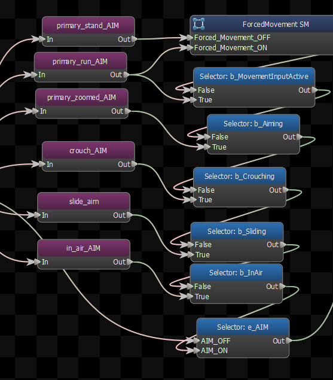
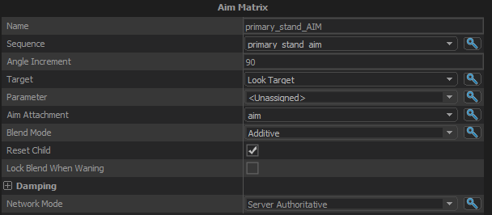

Treats each frame of a single animation as the pose for a direction, and will blend them to create a combined pose to \"aim\" the character in that given direction.
AIM matrix sequence can be created in ModelDoc with AnimSubtract and usually subtracting the 4th frame of the animation.

## Sequence
The sequence containing the aim poses in each frame.  Assumes that the frames are set up like this:

- <b>1. Bottom Left</b>
- <b>2. Bottom Center</b>
- <b>3. Bottom Right</b>
- <b>4. Middle Left</b>
- <b>5. Middle Center</b>
- <b>6. Middle Right</b>
- <b>7. Up Left</b>
- <b>8. Up Center</b>
- <b>9. Up Right</b>
- <b>10. Straight Up</b>

## Angle Increment
The angle difference between the center pose and the outer poses.  eg: if the Angle Increment is 45, then the right pose is assumed to point 45 degrees to the right, the up pose points 45 degrees up, etc.

## Max Yaw Angle
The angle difference between the center pose and the outer yaw poses.  eg: if the Max Yaw Angle is 45, then the right pose is assumed to point 45 degrees to the right.

## Max Pitch Angle
The angle difference between the center pose and the outer pitch poses.  eg: if the Max Pitch Angle is 45, then the up pose is assumed to point 45 degrees upward.

## Target
The input vector that is driving the blend. What location this node should aim at?

## Parameter
If <b>Target</b> is set to <em>Position Parameter</em>, this field is the anim parameter that is driving the blend.  Note that only Vector parameters are displayed as options.

## Aim Attachment
The Aim Matrix needs to know not just what to aim <em>at</em>, but also where to aim <em>from</em>.  This field lets you pick an attachment that defines what this node considers \"forward\", and the blend of the aim frames will be made based on the direction to the target relative to this attachment.

## Blend Mode
Defines how the blend of the frames of the aim animation are applied to the pose from the child node:

- <b>None:</b> Aim anims are used as-is and not applied on top of a base pose  
- <b>Additive:</b> The aim pose is added to the base pose  
- <b>Bone Mask:</b> The aim pose is blended into the base pose using a per-bone mask  

## Reset Child
Whether or not the child of this node should get reset when it does.
## Lock Blend When Waning
Don't change the look direction if this node is blending out.

## Damping

Controls how the output of this node is blended over time.

### Speed Function
Controls how damped speed is adjusted based on how far the current value is from the target value. 
- <b>No Damping:</b> Damping is not applied.  
- <b>Constant:</b> The damping speed does not change with distance from the target value.  
- <b>Spring:</b> A critically damped spring is used to accelerate the current value toward the target value.  The farther the current value is from the target, the more the acceleration.  However the spring will not overshoot the target value.  
- <b>Asymmetric Spring</b>
### Speed Scale
Scales the speed of the damping, or in the case of the Spring <b>Speed Function</b> it controls the strength of the spring.
### Speed Scale (Falling)
When using AsymmetricSpring for <b>Speed Function</b> it controls the strength of the spring, only when damping to a lower value.
### Limit Speed
Toggle whether or not to clamp the damping speed
### Min Speed
If <b>Limit Speed </b>is set, this is the slowest speed that the dampened value can change at.
### Max Speed
If <b>Limit Speed </b>is set, this is the fastest speed that the dampened value can change at.