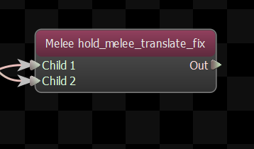
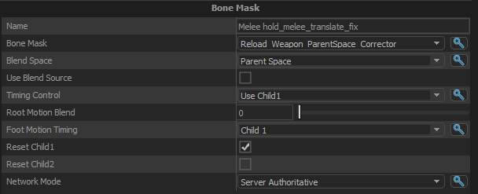

Creates a new pose by doing a per-bone blend of two base poses.  The per-bone weights are defined in the ModelDoc.

## Blend Space
The coordinate system that the bone transforms should be blended in.

- <b> Parent Space (Default):</b> Relative to each bones' parent    
- <b> Model Space:</b> Relative to the entity's model.  Think world space if the entity was standing at the world origin    
- <b> Model Space, Rotation Only:</b> Same as model space, but only the rotation is blended.  This prevents the mesh from deforming unnaturally due to unwanted bone translation.    

## Use Blend Source
When enabled, a value will be used to scale the values of the bone mask.  A value of 0 means nothing is blended in (ie: Child 1 is used unmodified), and a value of 1 means that 100% of the bone mask is used to blend Child 2 onto Child 1.

## Timing Control

Choose how the node its presents its  timing to its parent node.

- <b> Use Child1:</b> Use the cycle and duration of Child1 as the cycle and duration of this node.  The child nodes are not synchronized.    
- <b> Use Child2:</b> Use the cycle and duration of Child2 as the cycle and duration of this node.  The child nodes are not synchronized.    
- <b> Synchronize Children:</b> The cycle of the child nodes are kept in sync, and the cycle and duration of this node is a blend of the values from both children.    

## Root Motion Blend

Controls how the root motion is blended between the two source animations.  A value of 0 means use only the motion from Child1, a value of 1 means use only Child2.

## Foot Motion Timing

Choose how the node its presents its  foot motion timing to its parent node.

- <b> Use Child1:</b> The foot motion from the first child is used   
- <b> Use Child2:</b> The foot motion from the second child is used   

## Reset Child1
If true, then when this node receives a reset it will forward the reset on to Child1.

## Reset Child2
If true, then when this node receives a reset it will forward the reset on to Child2.