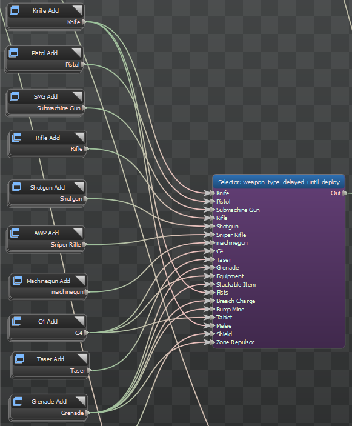
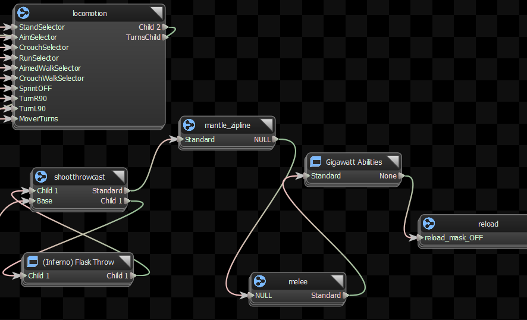

## Group

Group node can contain a set of nodes and can provide connections to and from them. They're very useful for organizing nodes into logical sub-sets.

## SubGraph

SubGraph Node imports all of the nodes, parameters and tags from a SubGraph File into the current graph,and allows connections between the nodes in the two graphs.

The SubGraph node can also remap the animations defined in the SubGraph, in case the animations in the containing graph have different names.

