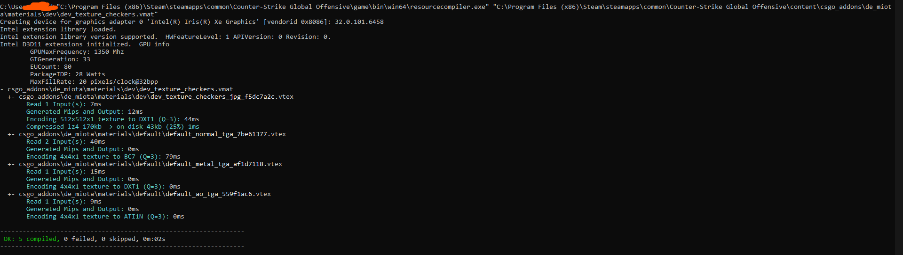
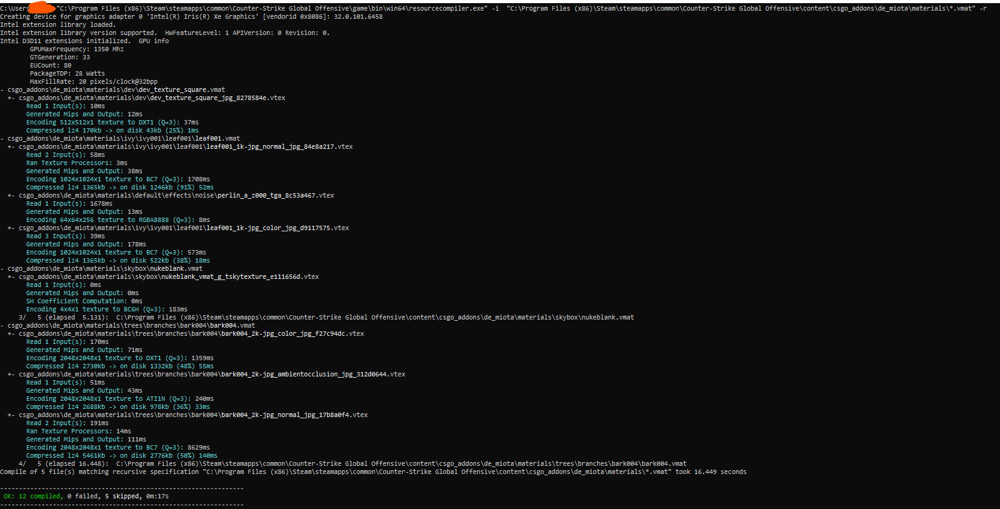

import DocCardList from '@theme/DocCardList';

`resourcecompiler.exe` is a [command-line](https://en.wikipedia.org/wiki/Command-line_interface) tool used to process and compile game assets.  
The generated output usually retains the same extension as the source file, but with a `_c` suffix to indicate it is the compiled version. These compiled assets are copied into the `game` directory for use at runtime.  

:::info
`resourcecompiler.exe` is located in the `game/bin/win64` folder.
:::

---

## Usage

To use `resourcecompiler.exe`, run it from a console with the `-i` option followed by the absolute path to the source file(s).  

:::warning
Source asset files must be located inside the `content` directory.  If they are not, compilation will fail.
:::

Example:
```bash
"C:\Program Files (x86)\Steam\steamapps\common\Counter-Strike Global Offensive\game\bin\win64\resourcecompiler.exe" -i "C:\Program Files (x86)\Steam\steamapps\common\Counter-Strike Global Offensive\content\csgo_addons\test\materials\dev\dev_texture_checkers.vmat"
```

  

### Wildcards and recursive compilation
`resourcecompiler.exe` supports wildcards. To compile all `.vmat` files inside an addon, use:  

```bash
-i "C:\path\to\addon\materials\*.vmat" -r
```

Always include `-r` when using wildcards to ensure recursive directory scanning.  

  

---

## Command-line options

Below is the list of documented options:  

```
Usage: resourcecompiler <input resource file(s)>

Options:
  -i <files>          Source file(s) or resource project file list.
                      Wildcards are accepted.
                      The -i option can be omitted if file names are given directly.
  -filelist <file>    Specify a text file containing a list of files to compile.
  -r                  If wildcards are specified, recursively searches subdirectories.
                      (Consider using contentbuilder for large builds.)
  -nop4               Disables automatic Perforce checkout/add.
  -game <path>        Path to a gameinfo.gi file (which mod to build for).
                      If omitted, it is derived from the input file path.
  -v                  Verbose mode.
  -f                  Force compile all encountered resources.
  -fshallow           Force compile top-level resources; children and associates only if needed.
  -fshallow2          Force compile top-level resources and their children; associates only if needed.
  -pc                 Compile resources for Windows PC (default).
  -novpk              Generate loose files instead of a VPK.
  -vpkincr            Incrementally update a VPK; existing files remain unless overwritten.
  -pauseiferror       Pause for keypress before quitting if errors occur.
  -pause              Pause for keypress before quitting.
  -changelist <name>  Use named changelist for Perforce operations.
  -skiptype <exts>    Skip recompilation for specified extensions (comma-separated).
                      Example: -skiptype vmat,vtex

  -crc <file>         Diagnostic: report CRC of the specified file and exit.
```

:::info
`resourcecompiler.exe` also supports asset-specific options not documented here.  
For example, compiling `.vmap` files may require additional arguments.  
:::

---

<DocCardList />
