import DocCardList from '@theme/DocCardList';

# Getting started with VConsole
`vconsole2.exe` is a standalone program that captures all output from the game console into a separate buffer.  
Unlike the Source 1 console, `vconsole2.exe` is far more powerful: it not only lets you search through messages, but also start processes, monitor engine events (via plugins), and more.

:::info
`vconsole2.exe` is located in the `game/bin/win64` folder.

In multiplayer Source 2 games, if VConsole is started without `-tools` mode it will not connect to the game.
:::

# VConsole Interface  
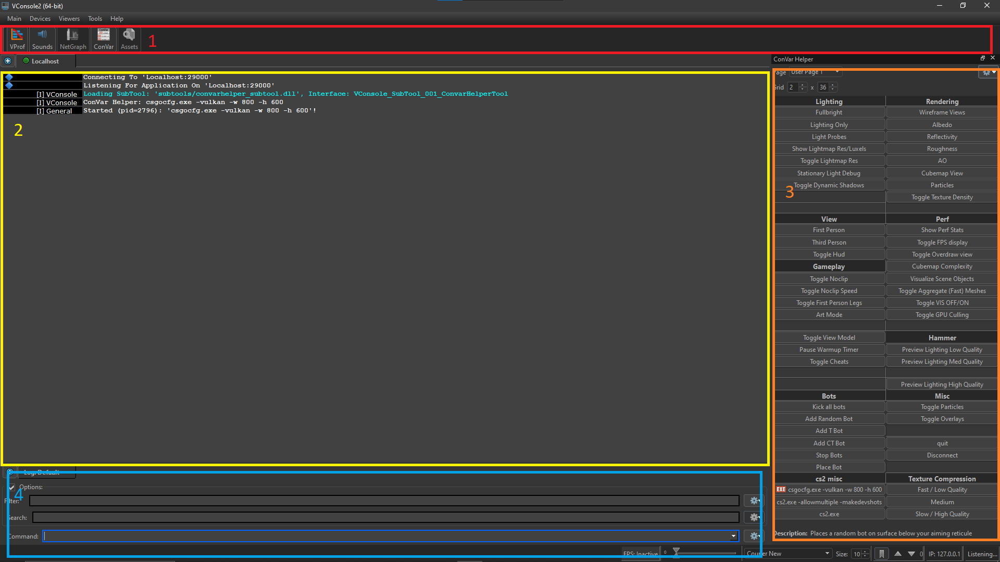

## 1- Toolbar  
This is the dock that holds all the console plugins. Left-click on an icon to open the corresponding plugin.

:::info
Some of the plugins shown in this guide may not exist in every Source 2 game (e.g. <Game name="hla"/>, <Game name="steamvr"/>, <Game name="dota2"/>).
:::

Example: the `NetGraph` plugin opened from the toolbar.  
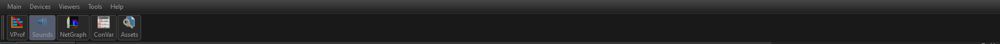  
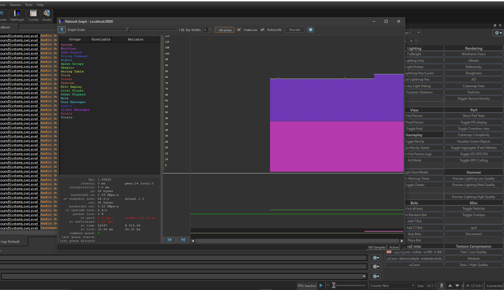

## 2- Console output
Displays the runtime output of the game and tools.  
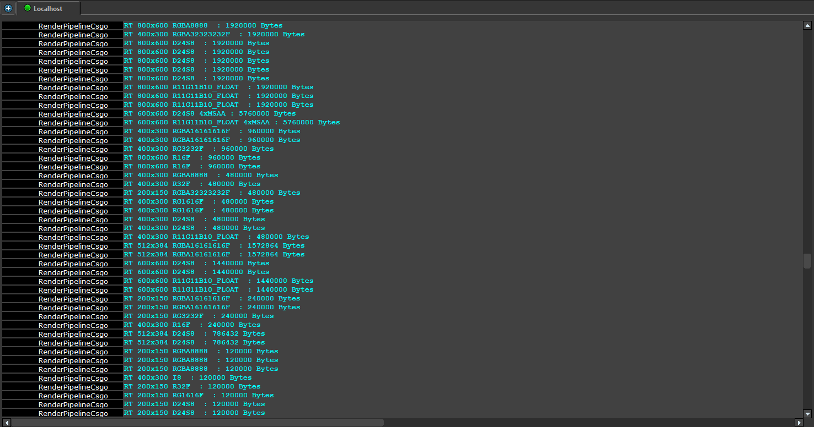

## 3- Plugin docking
Certain plugins can dock into the main VConsole window.  
For example, the `Convar Helper` is shown docked below.  
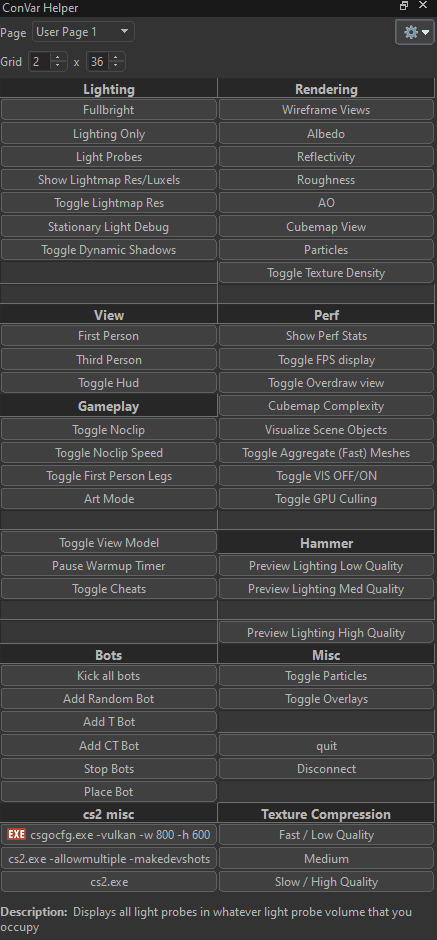

## 4- Input Bar
### Command
Type a command and press Enter — equivalent to typing in the in-game console.  
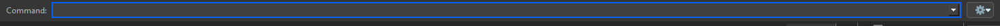  

### Search
Lets you search the VConsole message log for a specific string.  
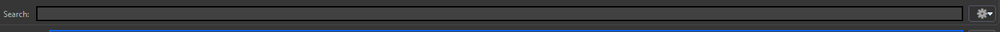  
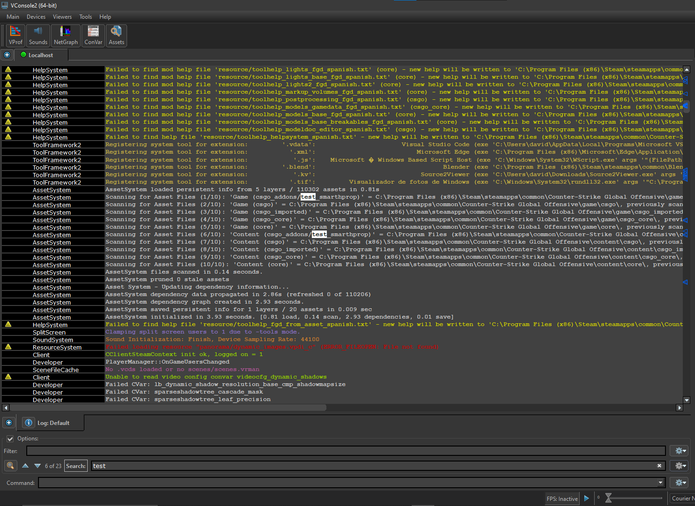

### Filter
Lets you filter the VConsole message log for a specific string.  
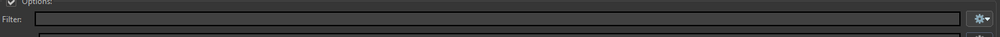  
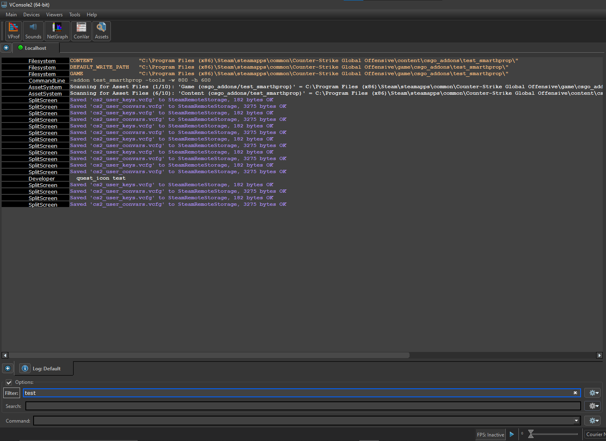

# VConsole Options
## Customization
Open `Main -> Options` to access the customization panel.  
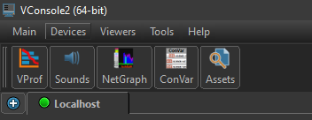  
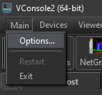  
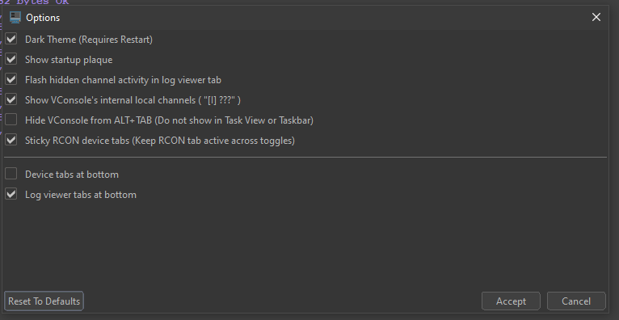

### Channel Activity
Sometimes subsystems output large amounts of information that can hide useful messages.  
To solve this, VConsole allows you to set the verbosity level of each channel, letting you control how much output is shown.
Open `Viewers -> Properties` to access the spew panel.  
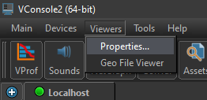
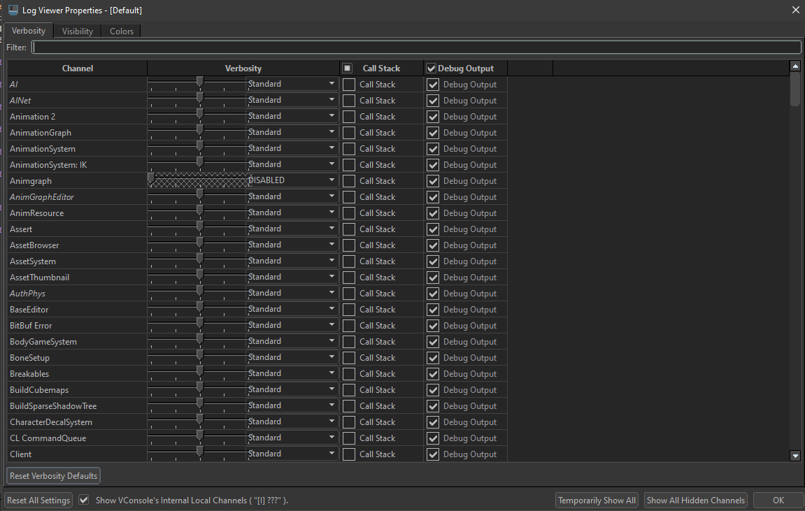

An alternative way is right click in the subsystem in the console output.
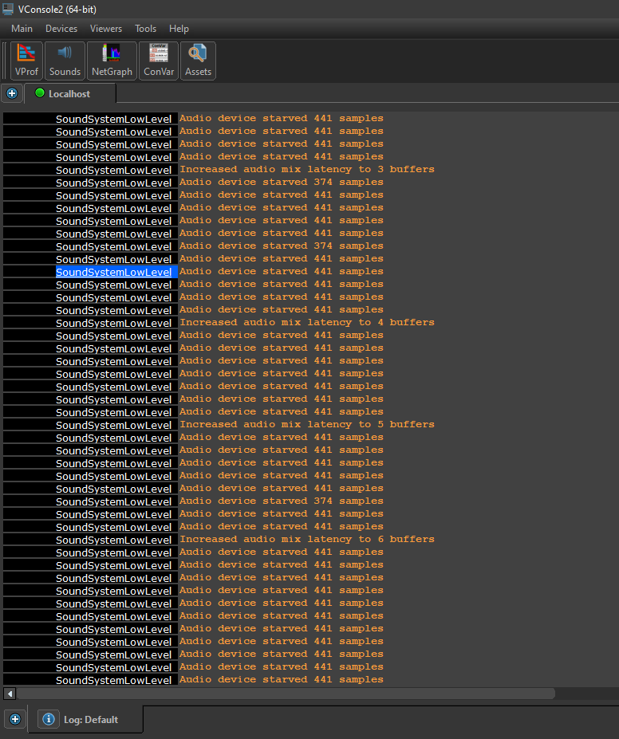
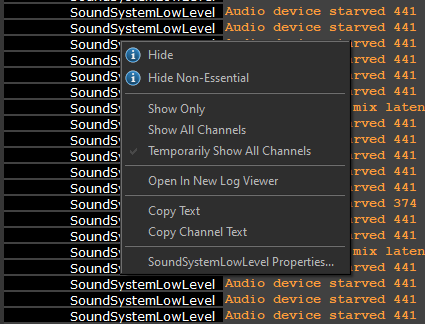

<DocCardList />
