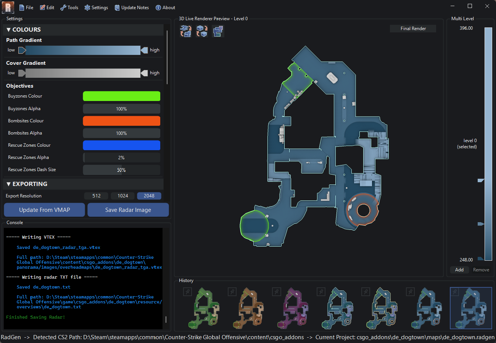

# RadGen

<Tool name="radgen"/> is a tool for <Game name="cs2"/> This tool can generate highly customisable overviews for maps using meshes, entities and/or materials, by assigning them to specific Selection Sets.
It can also be used in either a Material based workflow, or a Selection Set based workflow, supporting meshes or props in any setups. 

## Installation
Download the latest version here: https://radargenerator.github.io/

## Usage

Download and run RadGen, in the top left click on File -> New. 

Browse to the folder where your .vmap file is located, and select it. This will create a new RadGen project file (.radgen) next to your .vmap file. This will also copy the RadGen textures into the addon the map is located in.

You can use these two workflows in order to add map meshes and props to your radar:
- Material based workflow
- Selection Set based workflow

:::info
These workflows can be used interchangeably, and at the same time. There are no configuration changes needed to work in either way.
:::

Mesh entities including Buyzones, Bombsites and Rescue Zones, are drawn by default, however special materials for these are also included for special cases. 

:::tip
To generate the radar, click the 'Generate Radar' button on the bottom of the settings panel in RadGen. 
:::

If you have any issues, contact us on our <Social name="discord" suffix=" server" link="https://discord.com/invite/6RwR6SYBW6" />

## RadGen Types

|Name|Description|
|----|-----------|
|Path|The accessible ground areas the player can walk on.|
|Cover|The cover in the level, displayed on top of paths.|
|Overlap|The accessible path areas the player can walk on that are above a radgen_path area in the same overview level.|
|Remove|The inaccessible path areas. Stops the overview including anything in this area. A workaround to messy meshwork.|
|Buyzone|The Buyzones, these are usually picked up automatically from the map entity but a special material also exists.|
|Bombsite|The Bombsites, these are usually picked up automatically from the map entity but a special material also exists.|
|Tint|When an object has this type, it will use the hammer render color as its color, instead of the RadGen gradient.|
|RescueZone|The Rescue Zones, these are usually picked up automatically from the map entity but a special material also exists.|

## Workflow 1 (Material based)

:::tip
Apart from buyzones and bombsites or if in a RadGen selection set, RadGen will only display mesh faces with a RadGen texture applied to them.\
You can apply the textures to any face of a mesh. 
:::

### Materials

These are the materials that can be used with the Material based workflow. 

|Image|Material Name|Description|
|-----|-------------|-----------|
||radgen/RadGen_path|Displays a Path.|
||radgen/RadGen_cover|Displays Cover.|
||radgen/RadGen_overlap|Displays an Overlap.|
||radgen/RadGen_remove|Pixels under Remove geometry will not be rendered|
||radgen/RadGen_bombsite|Defines a volume as a Bombsite.|
||radgen/RadGen_buyzone|Defines a volume as a Buyzone.|
||radgen/RadGen_rescue_zone|Defines a volume as a Rescue Zone.|
||radgen/RadGen_tint|When an object has this type, it will use the hammer render color as its color, instead of the RadGen gradient.|

## Workflow 2 (Selection Set based)

You can also use the same workflow as TAR and JERC (CS:GO auto radar tools), avoiding the need of using the RadGen materials, and allowing you to use your already placed meshes for the overview.

Most objects can be added to a selection set, for example: props, meshes, and mesh entities.

:::warning
Face selection sets are supported, but they might give strange results, use with caution.
:::

### Selection Sets

|Name|Description|
|----|-----------|
|radgen_path|The accessible ground areas the player can walk on.|
|radgen_cover|The cover in the level, displayed on top of paths.|
|radgen_overlap|The accessible path areas the player can walk on that are above a radgen_path area in the same overview level.|
|radgen_remove|The inaccessible path areas. Stops the overview including anything in this area. A workaround to messy meshwork.|
|radgen_tint|An object which has this type will use the hammer render color as its color, instead of the RadGen gradient.|
